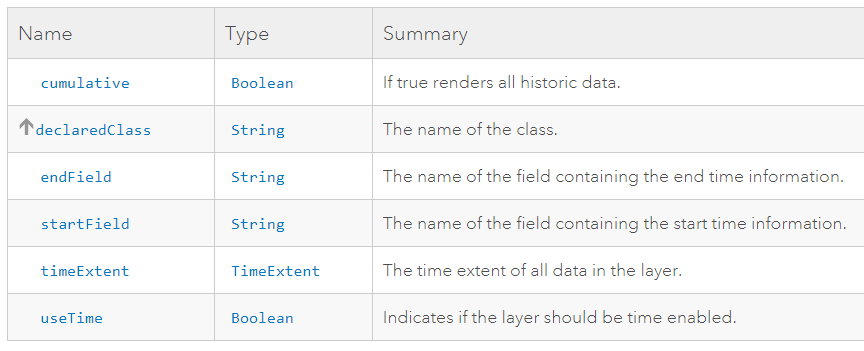

<!-- .slide: data-background="../reveal.js/img/2019/devsummit/bg-1.png" -->

<h1 style="text-align: left; font-size: 80px;">Visualizing Temporal Data</h1>
<h2 style="text-align: left; font-size: 60px;">with the ArcGIS API for JavaScript</h2>
<p style="text-align: left; font-size: 30px;">Yann Cabon | Richie Carmichael | Jeremy Bartley</p>
<p style="text-align: left; font-size: 30px;">
    <a href="https://github.com/ycabon">@ycabon</a> |
    <a href="https://github.com/richiecarmichael">@richiecarmichael</a>
</p>
<p style="text-align: left; font-size: 30px;">slides: <a href=""><code>TODO</code></a></p>

---

## Agenda
- Time support in the JS API
- New APIs in 4.11
- Visualizing time using Arcade
- Visualizing time using Visual Variables

---

### Time support in ArcGIS
- Showing a webmap with time
- 3.x API

---

### Time support in 4.x - Roadmap
- What do we ship in 4.11:
  - Time metadata
    - TimeInfo
    - TimeExtent
  - Server-side queries
  - Client-side queries
  - Client-side filtering (display)
- Next
  - Image layers: TileLayer, MapImageLayer, ImageryLayer
  - New TimeSlider widget

---

### Time Metadata
```js
var featureLayer = new FeatureLayer({
    url: "https://sampleserver6.arcgisonline.com/arcgis/rest/services/Earthquakes_Since1970/FeatureServer/0"
});
featureLayer.load().then(function(){
    var timeInfo = featureLayer.timeInfo;

    console.log(`
        Start Field: ${timeInfo.startField}       // date_
        End Field:   ${timeInfo.endField}         // null
        Time Extent:
            Start:   ${timeInfo.timeExtent.start} // Sat Jan 03 1970 16:00:00 GMT-0800 (Pacific Standard Time)
            End:     ${timeInfo.timeExtent.end}   // Wed May 27 2009 17:00:00 GMT-0700 (Pacific Daylight Time)
    `);
});
```

---

### TimeInfo

- Temporal properties intended by the service publisher.
- Used by the API for building queries and other widgets.

---

### TimeExtent

- Used by [TimeInfo](https://developers.arcgis.com/javascript/latest/api-reference/esri-layers-support-TimeInfo.html) metadata and [Query](https://developers.arcgis.com/javascript/latest/api-reference/esri-tasks-support-Query.html) to describe a period of time.

---

### Server-side queries
```js
var query = {
  timeExtent: {
    start: new Date(2000, 0, 1),
    end: new Date(2007, 0, 1)
  },
  where: "mag >= 5"
};
featureLayerQuake.queryFeatureCount(query).then(function(count){
  console.log(`${count} quakes found.`);  // e.g. 9235 quakes found.
});
```
- _timeExtent_ added to [Query](https://developers.arcgis.com/javascript/latest/api-reference/esri-tasks-support-Query.html)
- Layers must be _time enabled_
- *Tip:* Use the [developer dashboard](https://developers.arcgis.com/dashboard) to retroactively time-enabled layers

---

### More server-side queries
```js
FeatureLayer.queryExtent()
FeatureLayer.queryFeatureCount()
FeatureLayer.queryFeatures()
FeatureLayer.queryObjectIds()
```

---

### Client-side queries
[demo](https://richiecarmichael.github.io/quake-map/index.html)

---

```js
view.on("pointer-move", function(event){
    if (!quakeView) { return; }
    event.stopPropagation();

    const query = featureLayerQuake.createQuery();
    query.timeExtent = {
        start: startTime,
        end: endTime
    };
    query.geometry = view.toMap(event);
    query.distance = 500;
    query.units = "kilometers";
    query.returnQueryGeometry = true;

    quakeView.queryFeatures(query).then(function(results) {
        // Draw selection circle.
        view.graphics.removeAll();
        view.graphics.add(new Graphic({
            geometry: results.queryGeometry,
            symbol: {
                type: "simple-fill",
                color: null,
                outline: {
                    color: [255, 255, 255, 0.5],
                    width: 0.5
                }
            }
        }));

        // Highlight selected Earthquakes.
        if (highlight) {
            highlight.remove();
            highlight = null;
        }
        highlight = quakeView.highlight(results.features);

        // Highlight selected Earthquakes in chart.
        d3.selectAll("#dots circle").classed('highlight', false);
        results.features.forEach(function(feature){
            const dot = index[feature.attributes.OBJECTID];
            d3.select(dot).classed('highlight', true);
        });
    });
});
```

---

### Client-side queries
```js
FeatureLayerView.queryExtent()
FeatureLayerView.queryFeatureCount()
FeatureLayerView.queryFeatures()
FeatureLayerView.queryObjectIds()
```

---

### Client-side queries - tips
```js
view.whenLayerView(featureLayerQuake).then(function(layerView){
    layerView.watch("updating", function(value){
        if (!value){
            // Finished updating
        }
    });
});
```
- Wait for content to be downloaded
- Geometry is generalized
- Restrict queries to information in visual extent

---

### Client-side filtering


---

### Enabling client-side filtering
```js
var quakeView = null;
view.whenLayerView(featureLayerQuake).then(function(layerView){
    quakeView = layerView;
});
```
```js
function updateMapView(startDate, endDate) {
    quakeView.filter = {
        where: "mag >= 5",
        timeExtent: {
            start: startDate,
            end: endDate
        }
    };
}
```

---

<!-- Animated gif showing an outside effect. -->


---

### Filtering with effects
```js
function updateMapView(startDate, endDate) {
    quakeView.effect = {
        filter: {
            where: "mag >= 5",
            timeExtent: {
                start: startDate,
                end: endDate
            }
        },
        includedEffect: null,
        excludedEffect: "saturate(0%) opacity(25%)"
    };
}
```

---

### Supported effects
```css
brightness(0.4);
contrast(200%);
grayscale(50%);
hue-rotate(90deg);
invert(75%);
opacity(25%);
saturate(30%);
sepia(60%);
```

---

## Visualizing time using Arcade: Color earthquakes by age.

TODO Jeremy

---

## Visualizing time using Visual Variables

[](./demos/animate_vv/animate_vv.html)

---

## Visualizing time using Visual Variables

[](https://twitter.com/EsriUKGeoDev/status/1010140091396784128/photo/1)

---

## Client-side - Building a heatmap chart using clientside statistics

[](./demos/heatmap_chart/index.html)

---

<!-- .slide: data-background="../reveal.js/img/2019/devsummit/bg-5.png" -->

## Headline Here 5

* Bullet [points here](http://hakim.se).

---

<!-- .slide: data-background="../reveal.js/img/2019/devsummit/bg-6.png" -->

## Headline Here 6

* Bullet [points here](http://hakim.se).

---

<!-- .slide: data-background="../reveal.js/img/2019/devsummit/bg-esri.png" -->

---

<!-- .slide: data-background="../reveal.js/img/2019/devsummit/bg-rating.png" -->